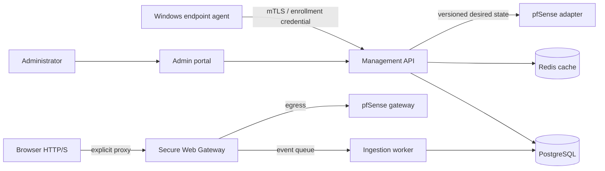

# Architecture

## Context and responsibilities

pfSense remains the endpoint default gateway. SIP, RTP, LAN traffic, and administrator-defined private/internal destinations bypass the explicit web proxy. Firewall rules deny direct endpoint Internet access on TCP 80/443 while allowing endpoint-to-proxy and proxy-to-Internet paths.

The management API owns configuration and authorization. PostgreSQL is authoritative. Redis holds revocable sessions, short-lived compiled-policy snapshots, counters, and queues only. Proxy nodes consume immutable versioned policy bundles and publish events asynchronously; they do not manage routing. Firewall adapters translate desired inter-VLAN policy but do not own its source definition.

## API architecture

Routes are versioned under `/api/v1`. Routers depend on services, services depend on repositories, and infrastructure adapters implement explicit ports. Every protected endpoint declares permissions. Optimistic version fields prevent lost policy updates. Events and policy bundles carry schema versions and idempotency keys.

Phase 1 exposes authentication, devices, agent enrollment/heartbeat, policies/evaluation, web-event ingestion, audit queries, dashboard summary, and health. SSE/WebSocket fan-out and durable queue consumers are subsequent vertical slices; interfaces remain transport-neutral.

## Scale and availability

API and proxy nodes are stateless and horizontally scalable. Device identity, policy versions, and audit records are node-independent. PostgreSQL proxy events are time-partitioned monthly; summary tables avoid scanning raw traffic. A durable broker can replace Redis Streams without changing producers. Initial sizing is 100–500 endpoints.
